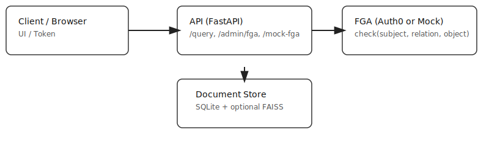

<p align="center">
	<a href="https://github.com/vannu07/The-Privacy-Aware-RAG-Bot">
		
	</a>
</p>

<p align="center">
	<a href="https://github.com/vannu07/The-Privacy-Aware-RAG-Bot"></a>
</p>

# Privacy-Aware RAG Bot — Pro Demo (Auth0 FGA)

> A minimal, production-minded demo that prevents LLM context leakage by enforcing document-level authorization (Auth0 FGA compatible). Built with Python + FastAPI, optional FAISS vector retrieval, and an easy developer PKCE flow for Auth0 testing.

Badges

- 
- 
- 
- 

Made by: Varnit Kumar (@vannu07)

---

## Table of contents

- [Why this project](#why-this-project)
- [Highlights](#highlights)
- [Screenshots & diagram](#screenshots--diagram)
- [Quickstart — one-liners](#quickstart---one-liners)
- [Detailed setup](#detailed-setup)
- [Docker](#docker)
- [Auth0 OIDC (PKCE) dev flow](#auth0-oidc-pkce-dev-flow)
- [FGA integration points](#fga-integration-points)
- [Admin (manage relationships)](#admin-manage-relationships)
- [Troubleshooting & FAQs](#troubleshooting--faqs)
- [References & credits](#references--credits)

---

## Why this project

- Prevents LLM context leakage by enforcing that only documents the caller is authorized to view are returned from the retriever.
- Shows where an external FGA check is called in the RAG pipeline (candidate filtering step).
- Small, extensible, and suitable as an internal HR/legal assistant demo.

## Highlights

- Document-level authorization enforced at retrieval time.
- Optional FAISS vector retrieval (enable with `USE_VECTOR=1`).
- Auth0 OIDC PKCE demo flow to get real tokens (developer mode).
- Local mock FGA endpoint for development and tests.

## Screenshots & diagram



_(If you want custom screenshots, drop images into `.github/` and I'll wire them in.)_

## Quickstart — one-liners

Clone, create a venv, install, run server (SQL mode):

```bash
git clone https://github.com/vannu07/The-Privacy-Aware-RAG-Bot.git
cd The-Privacy-Aware-RAG-Bot
python -m venv .venv && source .venv/bin/activate
pip install -r requirements.txt
uvicorn app.main:app --reload
```

Run the quick integration script that shows manager vs employee access:

```bash
python tests/test_access.py
```

Expected: manager (`bob`) sees `doc_salary_2024`, employee (`alice`) does not.

## Detailed setup

1) Create and activate venv

```bash
python -m venv .venv
source .venv/bin/activate
```

2) Install requirements

```bash
pip install -r requirements.txt
```

3) Environment variables (dev)

Create a `.env` or export these in your shell. Most are optional for local dev.

```bash
# Optional: enable vector search (FAISS + sentence-transformers)
export USE_VECTOR=0

# Optional Auth0 (use if you want OIDC PKCE flow)
export AUTH0_DOMAIN=""
export AUTH0_CLIENT_ID=""
export AUTH0_AUDIENCE=""
export AUTH0_REDIRECT_URI="http://127.0.0.1:8000/auth/callback"

# Dev fallback secret (only for local dev; replace in production)
export APP_SECRET="devsecret"
```

4) Start server

```bash
uvicorn app.main:app --reload
```

### Optional: enable vector search

```bash
USE_VECTOR=1 uvicorn app.main:app --reload
```

Note: vector mode will download a transformer model and build embeddings on first run. For CI, run tests with `USE_VECTOR=0` to avoid heavy downloads.

## Docker

Build and run with Docker (simple developer image):

```bash
docker build -t rag-fga-demo .
docker run --rm -p 8000:8000 -e APP_SECRET=devsecret rag-fga-demo
```

## Auth0 OIDC (PKCE) dev flow

1. Configure these env vars (or use a `.env` file):

```bash
export AUTH0_DOMAIN="<your-tenant>.auth0.com"
export AUTH0_CLIENT_ID="<your-client-id>"
export AUTH0_AUDIENCE="<your-api-audience>"
export AUTH0_REDIRECT_URI="http://127.0.0.1:8000/auth/callback"
```

2. Visit the login helper in your browser:

```
http://127.0.0.1:8000/auth/login
```

You will be redirected to Auth0 and back to a small developer callback that displays tokens. Grab the `access_token` and supply it in the Authorization header when calling `/query`.

## FGA integration points

- Local mock: `POST /mock-fga/check` accepts `{subject, relation, object}` and returns `{allowed: true|false}`.
- External FGA: set `AUTH0_FGA_URL` and optionally `AUTH0_FGA_TOKEN` to call an external FGA from `app/fga.py`.
- Important: call FGA on candidate documents before adding them to LLM context.

## Admin (manage relationships)

- `POST /admin/fga` — add relationship (manager-only). Body: `{subject, relation, object}`.
- `DELETE /admin/fga` — remove relationship (manager-only).
- `GET /admin/fga` — list relationships (manager-only).

## Troubleshooting & FAQs

- Q: “Uvicorn not found” — A: activate the venv and run `pip install -r requirements.txt`.
- Q: “Tests are failing due to missing models” — A: set `USE_VECTOR=0` when running CI or tests locally to skip FAISS/model downloads.
- Q: “How do I add a screenshot?” — A: drop images into `.github/` and reference them in the README; I used `.github/hero.svg` and `.github/architecture.svg` as placeholders.

## References & credits

- Auth0 for AI Agents: https://auth0.com/docs/ai
- Assistant0 sample: https://github.com/auth0-samples/auth0-assistant0
- Labs: Auth0 FGA for RAG: https://github.com/kazemicode/labs-auth0-fga-for-rag

---

Made with care — Varnit Kumar (@vannu07)
